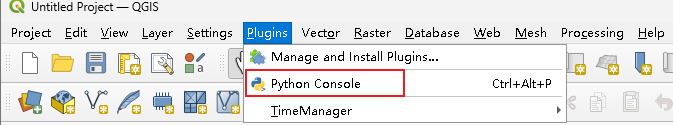
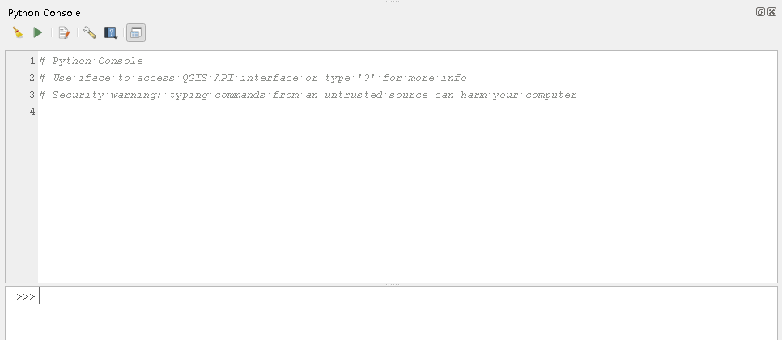
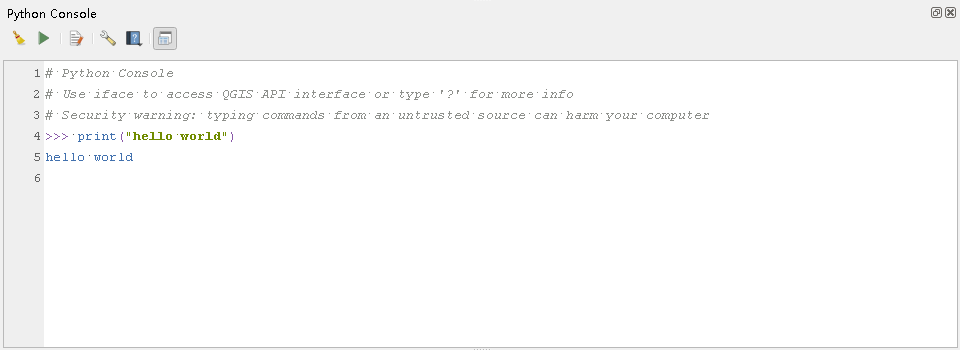
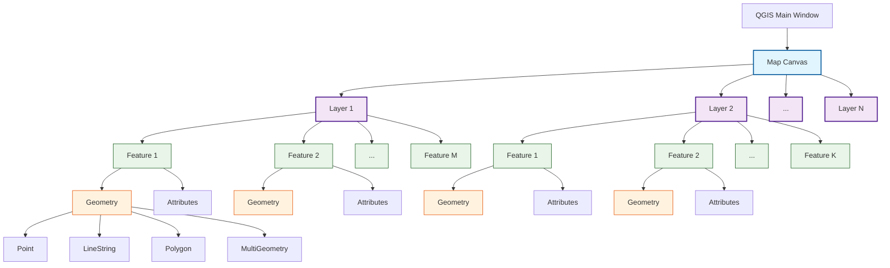
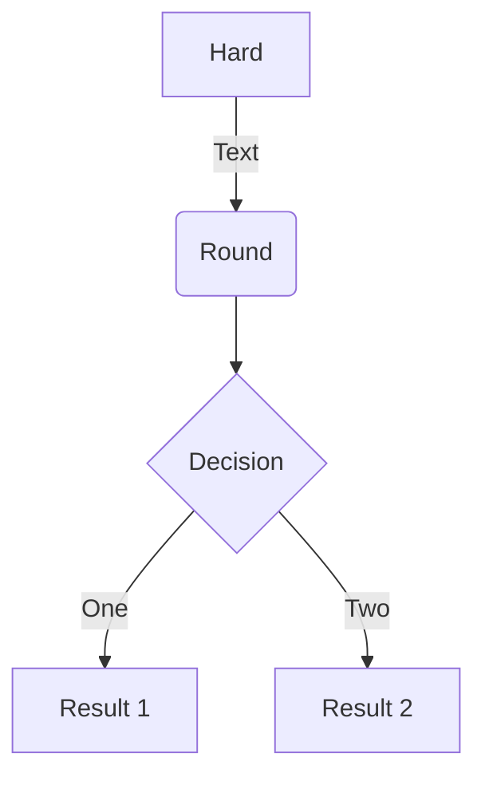

# 入门

> 本节主要介绍如何搭建QGIS的python控制台开发环境，完成第一个嵌入程序

## 安装QGIS并打开控制台

控制台应用程序的QGIS安装非常简单，QGIS应用程序内置了python控制台，所以正常安装的QGIS程序可以直接作为开发环境。



打开后，你会看到一个类似命令行的窗口，主要由三部分组成：

1. **主输入区：** 窗口下半部分，带有 `>>>` 提示符。这是你输入代码的地方。

2. **输出/历史面板：** 窗口上半部分，显示你执行的命令历史、代码运行结果和任何错误信息。

3. **工具栏：**

   - **清除控制台：** 清空历史记录。

   - **运行脚本：** 加载并执行外部的 `.py` 脚本文件。

   - **保存脚本：** 将你在控制台中输入的代码保存到文件。

   - **显示编辑器：** 打开一个多行代码编辑器，方便编写更复杂的脚本。



​	至此我们可以把python console 当做一个基础的python环境来使用，试试打印“hello world”吧。



## 基础操作

在开始之前，我们先简单回忆一下QGIS中对图层、要素和几何体的表达。






**简单来说：**

- QGIS画布可以同时呈现多个矢量图层
- 一个矢量图层包含多个固定格式（含有相同的属性字段）的要素

- 一个要素由多个属性字段和一个几何体组成

另外，我们需要介绍一个新朋友 **iface**. 

-  iface是qgis.utils模块中的一个特殊变量，代表整个QGIS图形界面的实例。它是我们与QGIS UI界面交互的桥梁。

好的，让我小试牛刀吧！

1. mapCanvas() 地图画布

   ```python
   canvas = iface.mapCanvas()
   extent = canvas.extent()
   print(f"当前地图范围是：{extent.toString()}")
   
   ## 当前地图范围是：-3.5000000000000000,-1.0000000000000000 :3.5000000000000000,1.0000000000000000
   ```

2. 创建新的图层与几何体

   ```python
   # 创建一个内存中的点图层
   vlayer = QgsVectorLayer("Point?crs=epsg:4326", "我的临时点", "memory")
   provider = vlayer.dataProvider()
   
   # 添加一个属性字段
   provider.addAttributes([QgsField("名称", QVariant.String)])
   vlayer.updateFields()
   
   # 创建一个新的点要素
   feat = QgsFeature()
   feat.setAttributes(["上海"])
   
   # 设置几何体 (经度，纬度)
   point = QgsGeometry.fromPointXY(QgsPointXY(121.47, 31.23))
   feat.setGeometry(point)
   
   # 将要素添加到图层
   provider.addFeatures([feat])
   
   # 将新图层添加到项目中
   QgsProject.instance().addMapLayer(vlayer)
   print("新点图层已创建并添加到地图！")
   ```

   - 此时可以在图层窗口的看到，新建一个点图层。 该点图层含有一个坐标为(121.47, 31.23)的点要素。

3. 与图层进行交互

   ```python
   active_layer = iface.activeLayer()
   if active_layer:
       print(f"当前激活图层是：{active_layer.name()}")
   else:
       print("没有激活的图层！")
   
   ##  当前激活图层是：我的临时点
   ```

   ```python
   layers = QgsProject.instance().mapLayers()
   for layer_id, layer in layers.items():
       print(f"图层ID: {layer_id}, 图层名: {layer.name()}")
       
   ## 图层ID: ______8330813e_ecdc_4093_9b77_def51f9d5080, 图层名: 我的临时点
   ```

4. 遍历要素与属性查询

   ```python
   layer = iface.activeLayer()
   if not layer or not layer.isValid():
       print("图层无效！")
   else:
       # 遍历所有要素
       for feature in layer.getFeatures():
           # 打印要素的ID和属性（假设有一个名为 'name' 的字段）
           print(f"要素ID: {feature.id()}, 名称: {feature['名称']}")
           # 获取几何体信息
           geom = feature.geometry()
           print(f"    几何类型: {geom.type()}, 中心点: {geom.centroid().asPoint()}")
   
   ## 要素ID: 1, 名称: 上海
   ##  几何类型: 0, 中心点: <QgsPointXY: POINT(121.46999999999999886 31.23000000000000043)>
   ```

   

