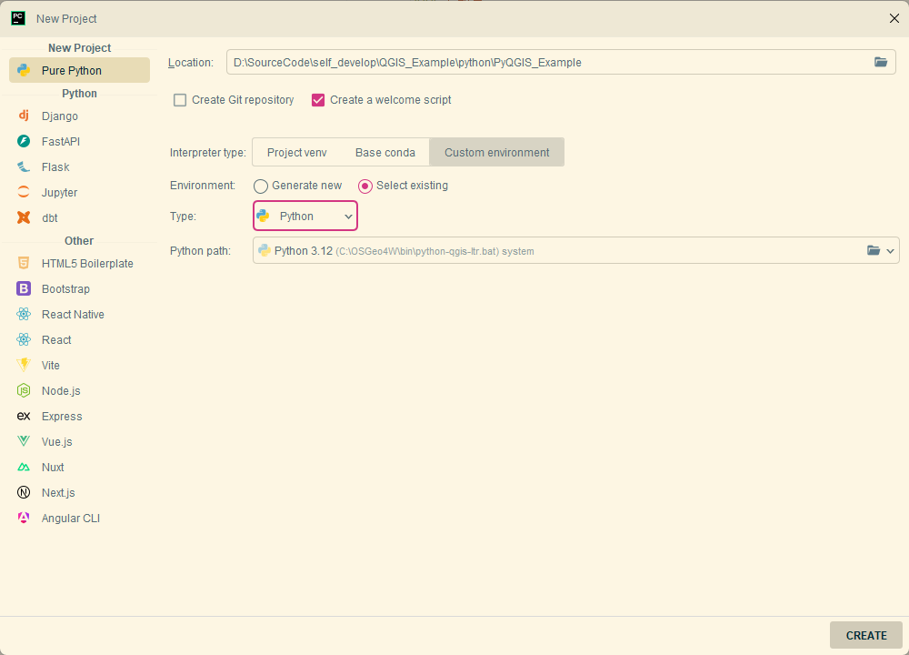
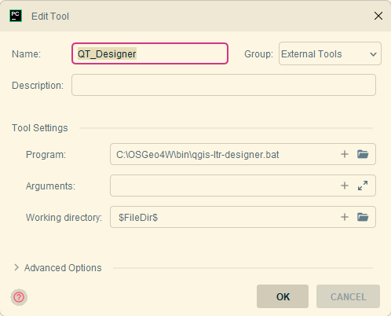
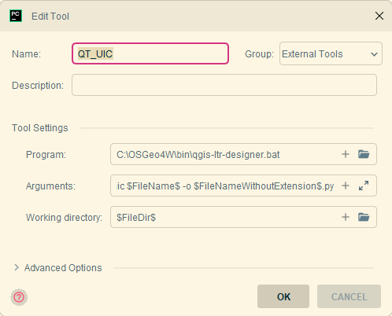
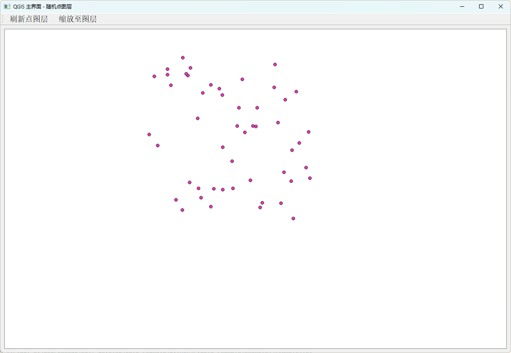

> 从本节开始，我们正式进入PyQGIS的开发教程。让我们从PyQGIS的开发环境搭建开始吧！

# 工具准备

搭建一套PyQGIS开发环境，我们需要安装如下工具：

1. QGIS客户端软件，最好是ltr版本，本次以3.34版本为例。 可以直接到官网下载。
2. PyCharm ， python开发的IDE。

# 配置步骤

1. 新建python项目，选择python解释器为：{OSGeo4W_root}/bin/python-qgis-ltr.bat 。  {OSGeo4W_root}代表OSGeo4W的根路径。

   

2. 配置Pyqt开发需要的额外工具，主要是DESIGNER UIC  RCC三个工具。为了方便使用，在Pycharm中以 External Tool 的形式引入。

   - QTDesigner:  QT界面设计工具
     - Working directory:  \$FileDir\$

   

   - UIC：  QT 界面编译工具
     - Working directory:  \$FileDir\$
     - Arguments:    -m PyQt5.uic.pyuic \$FileName\$ -o \$FileNameWithoutExtension\$.py

   

   - RCC ： QT 资源编译工具

     - Working directory:  \$FileDir\$

     - Arguments:    -m PyQt5.pyrcc_main \$FileName\$ -o \$FileNameWithoutExtension\$_rc.py

   

3. 包管理

   QGIS客户端的自带了一套完整的python环境，预先安装了包括 pyqt5 , gdal ,pyproj 在内的多个依赖库。根据业务需要，也可以手动安装需要的其它依赖包。 

   ```shell
   ./bin/python-qgis-ltr.bat -m pip install -r requirements.txt
   ```

# 跑个程序试试

经过一系列复杂的安装和配置之后，我们终于完成的PyQGIS开发环境的搭建。下面跑个程序试试吧。 

在mian函数中引入qigs包，获得qgis的版本并打印。

```python
from qgis.core import Qgis
from qgis.core import QgsApplication
if __name__ == '__main__':
    qgs = QgsApplication([], True)
    qgs.setPrefixPath('qgis', True)
    qgs.initQgis()
    version = Qgis.version()
    print(QgsApplication.prefixPath())
    print("Hello qgis,  version is {} ".format( version))
    qgs.exitQgis()
    
## C:/OSGeo4W/apps/qgis-ltr
## Hello qgis,  version is 3.34.6-Prizren 
```

# 第一个PyQGIS界面程序，启动！

我们需要回忆（或者重新学习）一下pyqt5的相关知识。pyqt5是一个qt5版本在python中的封装库，几乎可以在python环境中使用qt相关的所有功能。 

现在我们想要实现一个主界面，主界面的中央是一个qgis的画布，显示一个随机生成的点图层。

```python
import sys
import random

from qgis.core import QgsProject, QgsVectorLayer, QgsPointXY, QgsFeature, QgsGeometry, QgsField
from qgis.gui import QgsMapCanvas
from PyQt5.QtWidgets import QApplication, QMainWindow, QVBoxLayout, QWidget, QToolBar, QAction
from PyQt5.QtCore import QVariant, Qt


class QGISMainWindow(QMainWindow):
    def __init__(self):
        super().__init__()
        self.initUI()

    def initUI(self):
        # 设置窗口标题和大小
        self.setWindowTitle('QGIS 主界面 - 随机点图层')
        self.setGeometry(100, 100, 1200, 800)

        # 创建中央部件
        central_widget = QWidget()
        self.setCentralWidget(central_widget)

        layout = QVBoxLayout(central_widget)

        # 创建QGIS地图画布
        self.canvas = QgsMapCanvas()
        self.canvas.setCanvasColor(Qt.white)
        self.canvas.enableAntiAliasing(True)

        # 将画布添加到布局中
        layout.addWidget(self.canvas)

        # 创建工具栏
        self.createToolbar()

        # 生成随机点图层
        self.createRandomPointLayer()

        # 设置画布范围
        self.zoomToLayer()

    def createToolbar(self):
        """创建工具栏"""
        toolbar = QToolBar("主工具栏")
        self.addToolBar(toolbar)

        # 刷新按钮
        refresh_action = QAction("刷新点图层", self)
        refresh_action.triggered.connect(self.refreshPoints)
        toolbar.addAction(refresh_action)

        # 缩放至图层按钮
        zoom_action = QAction("缩放至图层", self)
        zoom_action.triggered.connect(self.zoomToLayer)
        toolbar.addAction(zoom_action)

    def createRandomPointLayer(self):
        # 创建内存图层
        self.point_layer = QgsVectorLayer("Point?crs=EPSG:4326", "随机点", "memory")
        provider = self.point_layer.dataProvider()

        # 添加属性字段
        provider.addAttributes([QgsField("id", QVariant.Int),
                                QgsField("x", QVariant.Double),
                                QgsField("y", QVariant.Double)])
        self.point_layer.updateFields()

        # 生成随机点
        features = []
        for i in range(50):  # 生成50个随机点
            # 在经纬度范围内生成随机点
            x = random.uniform(116.0, 117.0)  # 经度范围
            y = random.uniform(39.0, 40.0)  # 纬度范围

            # 创建点几何
            point = QgsPointXY(x, y)
            geometry = QgsGeometry.fromPointXY(point)

            # 创建要素
            feature = QgsFeature()
            feature.setGeometry(geometry)
            feature.setAttributes([i, x, y])
            features.append(feature)

        # 添加要素到图层
        provider.addFeatures(features)
        self.point_layer.updateExtents()

        # 将图层添加到项目
        QgsProject.instance().addMapLayer(self.point_layer)

        # 设置画布图层
        self.canvas.setLayers([self.point_layer])

    def refreshPoints(self):
        """刷新随机点"""
        # 移除旧图层
        QgsProject.instance().removeMapLayer(self.point_layer.id())

        # 生成新图层
        self.createRandomPointLayer()

    def zoomToLayer(self):
        """缩放至图层范围"""
        if self.point_layer:
            self.canvas.setExtent(self.point_layer.extent())
            self.canvas.refresh()


if __name__ == '__main__':
    # 创建QApplication实例
    app = QApplication(sys.argv)

    # 设置应用信息
    app.setApplicationName("QGIS随机点示例")

    # 创建并显示主窗口
    main_window = QGISMainWindow()
    main_window.show()

    # 运行应用
    sys.exit(app.exec_())
```

- 新建一个QGISMainWindow 继承自QMainWindow，用来描述主界面

- 新建一个 QgsMapCanvas对象，放置到中央窗体中

- 创建两个工具按钮，用于刷新和缩放到点图层

- createRandomPointLayer 函数用于创建随机点图层。更多的细节将在之后的章节中详细阐述，包括图层创建、要素属性设置、内存管理等。

- 最终运行成果如下图：

  

# 结语

本小节我们完成了一个PyQGIS开发环境从无到有的配置。跟随笔者的步伐，我们可以轻松的创建出第一个PyQGIS界面程序。请大家一定要动手实现哦。

如果你觉得有所帮助，不妨为我买杯咖啡吧。


