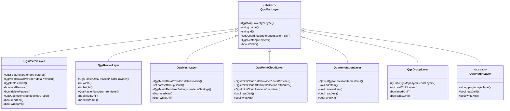

> 本节主要介绍PyQGIS中如何加载常见格式的矢量和栅格图层，和大家一起梳理QGIS对于图层生命周期的管理。

# 支持的数据格式

## 矢量数据格式

借助于ORG引擎的兼容能力，QGIS底层支持非常多的矢量数据源格式。

| 格式类别          | 格式名称                      | 文件扩展名          | 简介与说明                                                   |
| :---------------- | :---------------------------- | :------------------ | :----------------------------------------------------------- |
| **QGIS 原生格式** | **QGIS 项目文件**             | `.qgz`, `.qgs`      | QGIS 的主项目文件，保存地图布局、图层样式、数据源路径等，但其本身不是数据格式。 |
|                   | **QGIS 内存临时层**           | (无)                | 在 QGIS 会话期间创建的临时图层，用于中间处理，关闭后消失。   |
| **常见GIS格式**   | **ESRI Shapefile**            | `.shp` (主文件)     | **事实上的工业标准**。由多个文件组成（.shp, .shx, .dbf 等）。功能成熟，但不支持复杂数据类型（如曲线）。 |
|                   | **GeoPackage**                | `.gpkg`             | **现代推荐格式**。基于 SQLite 的单一文件格式，可包含矢量、栅格、样式、扩展等。是 Shapefile 的强大替代品。 |
|                   | **GeoJSON**                   | `.geojson`, `.json` | 基于 JSON 文本的格式，易于Web开发和数据交换。但文件体积较大，拓扑错误常见。 |
|                   | **GML**                       | `.gml`, `.xml`      | 基于 XML 的开放标准，常用于数据互操作和Web服务（WFS）。      |
|                   | **KML/KMZ**                   | `.kml`, `.kmz`      | Google Earth 的原生格式，KMZ 是压缩的 KML。在 QGIS 中打开和创建都非常方便。 |
| **数据库格式**    | **PostGIS**                   | (无，连接数据库)    | **功能最强大的空间数据库**。支持海量数据、空间拓扑、复杂查询、事务处理等，适合大型项目和企业级应用。 |
|                   | **SpatiaLite**                | `.sqlite`, `.db`    | 轻量级的单文件空间数据库，基于 SQLite。功能类似迷你版的 PostGIS，适合桌面和移动端。 |
|                   | **ESRI File Geodatabase**     | `.gdb` (目录)       | ESRI 的专有文件数据库格式。QGIS 可以**读取** 和**编辑** File GDB，但创建功能可能有限制。 |
|                   | **ESRI Personal Geodatabase** | `.mdb`              | 基于 Microsoft Access 的旧版 ESRI 格式。需要系统有相应驱动才能读取。 |
| **CAD格式**       | **DXF**                       | `.dxf`              | AutoCAD 数据交换格式。QGIS 可以读取其中的图形和属性，并可导出为 DXF。 |
|                   | **DWG**                       | `.dwg`              | AutoCAD 原生格式。需要通过 GDAL 的 DWGDriver 或使用第三方工具（如 ODA Converter）进行转换后读取。 |
| **Web数据服务**   | **WFS**                       | (URL)               | Web要素服务，用于通过HTTP请求在线传输矢量数据。QGIS 可以连接并加载为可编辑的图层。 |
|                   | **WMS**                       | (URL)               | Web地图服务，通常返回图像，但某些 WMS 也支持返回矢量要素（GetFeatureInfo）。 |
|                   | **Vector Tiles**              | `.pbf`, (URL)       | 金字塔分块的矢量数据，加载速度快，适合作为底图。QGIS 支持多种矢量切片协议。 |
| **其他格式**      | **GPX**                       | `.gpx`              | GPS 数据交换格式，用于存储航点、轨迹和路线。                 |
|                   | **CSV/TXT**                   | `.csv`, `.txt`      | 逗号分隔文本文件。如果包含坐标列（如X/Y或WKT几何），QGIS 可以将其作为矢量图层打开。 |
|                   | **MapInfo**                   | `.tab`, `.mif/.mid` | MapInfo Professional 软件的格式。                            |

## 栅格数据格式

借助GDAL引擎的强大能力，QGIS支持多种栅格数据格式。

### 高程数据格式

| 格式                | 扩展名 | 主要用途             |
| :------------------ | :----- | :------------------- |
| GeoTIFF             | .tif   | 通用高程数据         |
| SRTM HGT            | .hgt   | 航天飞机雷达地形数据 |
| USGS DEM            | .dem   | 美国地质调查局DEM    |
| Arc/Info ASCII Grid | .asc   | 网格高程数据         |

### 网络服务格式

| 格式 | 类型            | 协议 |
| :--- | :-------------- | :--- |
| WMS  | Web地图服务     | HTTP |
| WMTS | Web地图瓦片服务 | HTTP |
| TMS  | 瓦片地图服务    | HTTP |
| XYZ  | 标准瓦片服务    | HTTP |

# 加载图层

```python
import os
import sys

from qgis._core import QgsRasterLayer
from qgis.core import QgsProject, QgsVectorLayer, QgsPointXY, QgsFeature, QgsGeometry, QgsField
from qgis.gui import QgsMapCanvas
from PyQt5.QtWidgets import QApplication, QMainWindow, QVBoxLayout, QWidget, QToolBar, QAction
from PyQt5.QtCore import QVariant, Qt

current_path = os.path.abspath(__file__)
data_path = os.path.dirname(os.path.dirname(current_path))+"/data/"

class QGISMainWindow(QMainWindow):
    def __init__(self):
        super().__init__()
        self.canvas = None
        self.initUI()

    def initUI(self):
        # 设置窗口标题和大小
        self.setWindowTitle('QGIS 主界面')
        self.setGeometry(100, 100, 1200, 800)

        self.canvas = QgsMapCanvas()
        self.canvas.setCanvasColor(Qt.white)
        self.canvas.enableAntiAliasing(True)
        self.setCentralWidget(self.canvas)
        self.createToolbar()

    def createToolbar(self):
        toolbar = QToolBar("主工具栏")
        self.addToolBar(toolbar)
        refresh_action = QAction("加载所有矢量图层", self)
        refresh_action.triggered.connect(self.loadAllVectorLayers)
        toolbar.addAction(refresh_action)

    def loadAllVectorLayers(self):
        QgsProject.instance().removeAllMapLayers()

        geojson_layer = self.loadGeojsonLayer(data_path + "test_points.geojson", "GeoJSON点图层")
        shp_layer = self.load_shapefile(data_path + "test_lines.shp", "SHP线图层")
        spatialite_layer = self.load_spatialite(data_path + "test_ploygons.sqlite", "new_layer")
        raster_layer = self.load_tif(data_path + "random_china_raster.tif", "raster_layer")
        QgsProject.instance().addMapLayer(geojson_layer)
        QgsProject.instance().addMapLayer(shp_layer)
        QgsProject.instance().addMapLayer(spatialite_layer)
        QgsProject.instance().addMapLayer(raster_layer)

        # 设置画布图层
        self.canvas.setLayers([geojson_layer,shp_layer,spatialite_layer,raster_layer])
        self.canvas.zoomToFullExtent()


    def loadGeojsonLayer(self, geojson_path, layer_name):
        layer = QgsVectorLayer(geojson_path, layer_name, "ogr")
        # 检查图层是否有效加载
        if not layer.isValid():
            print(f"图层 {layer_name} 加载失败!")
            return None
        return layer

    def load_shapefile(self, path, layer_name):
        layer_name = "SHP图层"
        layer = QgsVectorLayer(path, layer_name, "ogr")
        if not layer.isValid():
            print(f"图层 {layer_name} 加载失败!")
            return None
        return layer

    def load_spatialite(self, path, layer_name):
        layer = QgsVectorLayer(path.replace("\\", "/"), layer_name, "ogr")
        # 检查图层是否有效加载
        if not layer.isValid():
            print(f"图层 {layer_name} 加载失败!")
            return None
        return  layer
    def load_tif(self, path, layer_name):
        layer = QgsRasterLayer(path, layer_name)
        if not layer.isValid():
            print(f"图层 {layer_name} 加载失败!")
            return None
        return  layer
if __name__ == '__main__':
    app = QApplication(sys.argv)
    app.setApplicationName("PyQGIS 加载图层示例")
    main_window = QGISMainWindow()
    main_window.show()
    sys.exit(app.exec_())
```

- 程序直接移植了上一小节中的主界面代码
- 从本地加载了三种矢量格式数据和一个栅格格式数据
- 最终将图层显示到地图画布上

- 下面我们来探讨一些较为底层的问题：
  - QGIS中图层的概念。QgsVectorLayer 和 QgsRasterLayer 是什么，他们之间有什么关系
  - 图层的生命周期
  - QgsMapCanvas 地图画布和图层的关系

# QGIS的图层

## 图层概念

QGIS中，图层是单一地理要素集合的载体，它链接到数据源并定义了这些要素的视觉外观（样式）。由此我们可以清晰的知道图层由两个部分组成：数据源+样式。

- 数据源：指存储在硬盘或者数据库中的数据，由几何体和属性组成，在GIS层名的表述为要素集。
- 样式： 基于数据源的信息，描述了如何在界面上显示数据源中的要素，颜色？大小？ICON等。
- 本节重点在于数据层面，样式层面的讨论我们放到后面的章节。

## 图层的继承结构

讲完了定义，我们一起来探究QGIS中的图层在代码层面如何抽象和实现。



1. **抽象基类 `QgsMapLayer`**:
   - 它是所有具体图层类型的**父类**。
   - 定义了所有图层都**必须具有的通用接口和属性**，例如：
     - `name()`: 图层名称
     - `id()`: 唯一ID
     - `crs()`: 坐标参考系统
     - `extent()`: 图层的地理范围
     - `isValid()`: 检查图层是否有效加载
   - 它本身是**抽象**的，你不能直接创建一个 `QgsMapLayer` 对象。
2. **核心具体类**:
   - **`QgsVectorLayer`**: 处理**矢量数据**（点、线、面）。这是最常用、功能最丰富的图层类之一。
   - **`QgsRasterLayer`**: 处理**栅格数据**（图像、DEM等）。
   - **`QgsMeshLayer`**: 处理**非结构网格数据**，常用于水文、海洋、气象模拟（如流速、水温）。
   - **`QgsPointCloudLayer`**: 处理**点云数据**（如LiDAR激光雷达）。
   - **`QgsVectorTileLayer`**: 处理矢量瓦片数据。
3. **结构与组织类**:
   - **`QgsAnnotationLayer`**: 用于管理地图上的临时注记、图形、文本等，独立于原始数据。
   - **`QgsGroupLayer`**: 一个“容器”图层，可以将多个其他图层组合在一起，作为一个单元进行管理（如显示/隐藏）。

可以清晰的看到，QGIS中的图层对象是一个非常典型的父类-子类的继承结构。QgsMapLayer作为抽象基类，负责描述公共的通用的信息。各个子类根据需要在抽象基类上进行功能扩展。

对比QgsVectorLayer和QgsRasterLayer:

| 特性维度         | QgsVectorLayer (矢量图层)                                    | QgsRasterLayer (栅格图层)                                    |
| :--------------- | :----------------------------------------------------------- | :----------------------------------------------------------- |
| **数据模型**     | 基于几何对象：**点(Point)、线(LineString)、面(Polygon)**     | 基于**像素矩阵**，每个像素有数值                             |
| **数据结构**     | 由**要素(Feature)**组成，每个要素包含： **几何形状** (Geometry) 和 **属性** (Attributes)。 | 由**波段(Band)**组成，每个波段是数值矩阵。 单波段：灰度、高程和多波段：RGB彩色影像。 |
| **数据来源示例** | Shapefile  GeoPackage  PostGIS GeoJSON                       | GeoTIFF   JPEG/PNG  DEM文件                                  |
| **数据提供者**   | `QgsVectorDataProvider`                                      | `QgsRasterDataProvider`                                      |
| **编辑能力**     | **完全可编辑**： • 添加/删除要素 • 修改几何形状 • 编辑属性表 | **基本不可编辑**： • 主要只读 • 可通过插件进行有限栅格绘图   |
| **分析操作**     | • 缓冲区分析 • 相交/联合 • 最近邻分析 • 网络分析             | • 栅格计算器 • 坡度/坡向分析 • 重分类 • 栅格矢量化           |
| **属性查询**     | **强大**： • 基于SQL的查询 • 复杂的属性过滤                  | **有限**： • 主要基于像素值 • 无复杂属性结构                 |
| **空间查询**     | • 包含、相交、相邻等 • 精确的几何关系判断                    | • 基于位置提取像素值 • 区域统计                              |
| **精度**         | **高精度**： • 明确的边界和坐标 • 不受缩放级别影响           | **分辨率依赖**： • 精度受像素大小限制 • 缩放过大会出现像素化 |

- QgsVectorLayer 
  - 描述矢量数据图层，其底层的数据结构采用了 几何体+属性 -> 要素 这样的表达
  - 支持编辑修改，提供了新增、删除、修改要素等功能
  - 提供强大的要素检索功能
- QgsRasterLayer
  - 描述栅格数据图层，其底层采用多波段像素矩阵
  - 常用于统计分析

# 图层的生命周期

程序中的任意一个对象都会占用一定的内存空间，在python中，内存的申请和释放由解释器自动处理，不需要开发者过多的关注。但是，当开发者面对一个体量较大的，由C++封装的库时，这个问题会隐隐约约的出现在开发的各个环节。如果没有清晰明确的理解QGIS程序中对于图层生命周期的管理，很可能导致程序出现异常的内存释放，进而导致程序崩溃。

## 图层“消失”了

通俗来讲，图层的生命周期代表着图层对象的创建、修改、使用和消亡的全过程。为了更直观的表现生命周期的影响，我们对上面的代码做如下改动：

```python
    def loadAllVectorLayers(self):
        QgsProject.instance().removeAllMapLayers()

        geojson_layer = self.loadGeojsonLayer(data_path + "test_points.geojson", "GeoJSON点图层")
        shp_layer = self.load_shapefile(data_path + "test_lines.shp", "SHP线图层")
        spatialite_layer = self.load_spatialite(data_path + "test_ploygons.sqlite", "new_layer")
        raster_layer = self.load_tif(data_path + "random_china_raster.tif", "raster_layer")
        #QgsProject.instance().addMapLayer(geojson_layer)
        #QgsProject.instance().addMapLayer(shp_layer)
        #QgsProject.instance().addMapLayer(spatialite_layer)
        #QgsProject.instance().addMapLayer(raster_layer)

        # 设置画布图层
        self.canvas.setLayers([geojson_layer,shp_layer,spatialite_layer,raster_layer])
        self.canvas.zoomToFullExtent()
```

修改代码后，图层将不会显示在地图画布上。这是为什么呢？ 按常规的思路分析，`self.canvas.setLayers([geojson_layer,shp_layer,spatialite_layer,raster_layer])`此句代码应该是将图层显示在画布上，只要执行到该代码，画布上应该会出现四个图层的内容，但是很遗憾，程序并没有绘制出我们期待的结果。

## 谁在管理图层的内存

python中，当一个对象被持有时，其内存会一直存在；当一个对象没有被任何引用指向时，会触发垃圾回收。根据上面注释后的代码分析，可以得到如下步骤：

1. 创建`geojson_layer `
2. 设置给了canvas对象
3. 随后离开了`loadAllVectorLayers`的作用域
4. 离开作用域后，因为没有被指向，所以触发了`geojson_layer ` 的垃圾回收，图层对象不再可用。所以，图层没有被正确的绘制到地图画布上

那么，聪明的你可能要问了，在步骤2中，已知`geojson_layer`被设置给了canvas对象，为什么离开作用域会被回收呢？因为canvas对象并没有持有图层对象。

至此，答案已经非常清晰了。谁在管理图层的内存呢？ 答案就是 `QgsProject.instance()`。`QgsProject.instance()` 是QGIS中的一个全局单例，负责管理项目的属性和配置，管理图层。读者如果对单例不太了解，可以简单的理解为存在于程序整个生命过程的一个变量，在程序结束时才会被销毁。

## 应该如何管理图层的生命周期

在一个单纯的GIS程序中，一般只存在一个地图画布。针对需要显示在画布上的一组图层，可以直接交给全局单例来管理，QGIS的底层可以很好的处理这个问题。

当我们开发的程序是一个含有多个地图画布的程序，每个地图画布都需要显示一组区别于其它画布的图层，此时需要我们手动来创建一个对象负责管理该组图层，管理对象的生存范围要大于等于地图画布的范围。

# 地图画布与图层的关系

经过上面的分析，我们可以非常容易的得出一个结论，两者在内存方面没有任何的持有关系。两者关系可以理解为数据和界面的分层设计：

- 图层持有数据和样式，告诉画布如何将它自身的内容渲染出来
- 画布执行渲染流程，按照图层的渲染需求进行渲染
- 图层的变化会直接触发画布的重绘

# 总结

好的，本小节我们从图层加载和显示出发，学习了QGIS支持的矢量格式和栅格格式。在此基础上，我们深入探讨了图层的概化及实现、图层的生命周期管理、画布与图层的关系等内容。

如果你觉得有所帮助，不妨为我买杯咖啡吧。


