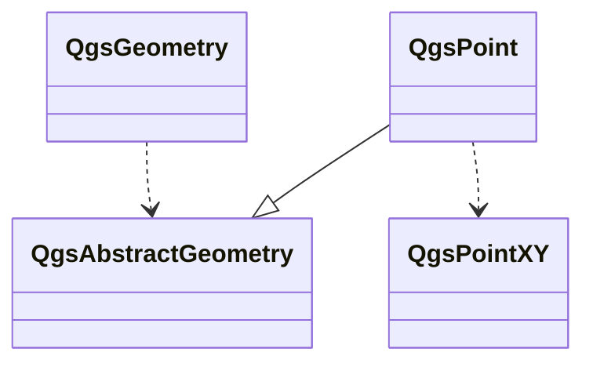
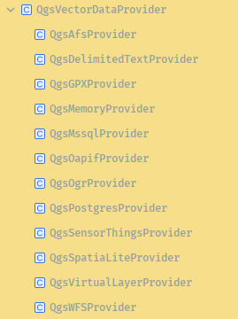

>本节主要介绍矢量图层的数据组成，包括属性、几何体和数据源三个层面，一起解构QGIS中对矢量数据的抽象吧！

# 要素的属性

要素是构成矢量数据模型的基本单元。 点图层中的一个点，线图层中的一条线，多边形图层中的一个面，都是以要素为单元进行描述。

属性是要素的重要组成部分，主要用于描述要素的非空间特征，另一个重要组成则是几何体。可以将图层想象为一个二维的表。每一列代表一个属性，每个属性都有各自的类型，几何体也可以理解为一个独立的属性。 每一行则是一个具体的要素。基于数据表的这种理解方式，很多时候我们可以用`SQL`中的**字段**来等价的替代**属性**。

## 属性类型

QGIS中的要素属性类型有如下几种：

|     类型      |       用途       |        示例        |
| :-----------: | :--------------: | :----------------: |
| **文本数据**  |    存储字符串    |     名称、地址     |
|   **整数**    |     存储整数     |   ID、人口、计数   |
| **小数/实数** | 存储带小数的数字 |  面积、长度、坐标  |
| **日期/时间** |   存储时间信息   | 创建日期、调查时间 |
|  **布尔值**   |   存储是/否值    | 是否可见、是否有效 |
|   **BLOB**    |     存储文件     |     照片、文档     |

根据数据源格式的不同，某些属性类型会不被支持或者会有新的属性类型出现。如BLOB类型，其底层使用二进制的形式存储数据，geojson格式在存储层面对此属性类型的支持不够完善。

- 文本数据： 用于存储文本格式的数据，对应字符串
- 整数： 用于存储 正负整数
- 实数： 用于存储实数，对应于 浮点数
- 应根据需要选择合适的类型，存放合适的数据

## QgsField

```c++
    /**
     * Constructor. Constructs a new QgsField object.
     * \param name Field name
     * \param type Field variant type, currently supported: String / Int / Double
     * \param typeName Field type (e.g., char, varchar, text, int, serial, double).
     * Field types are usually unique to the source and are stored exactly
     * as returned from the data store.
     * \param len Field length
     * \param prec Field precision. Usually decimal places but may also be
     * used in conjunction with other fields types (e.g., variable character fields)
     * \param comment Comment for the field
     * \param subType If the field is a collection, its element's type. When
     *                all the elements don't need to have the same type, leave
     *                this to QVariant::Invalid.
     */
    QgsField( const QString &name = QString(),
              QVariant::Type type = QVariant::Invalid,
              const QString &typeName = QString(),
              int len = 0,
              int prec = 0,
              const QString &comment = QString(),
              QVariant::Type subType = QVariant::Invalid );
```

|     参数名     | 是否必需 |                             描述                             |                  示例                   |
| :------------: | :------: | :----------------------------------------------------------: | :-------------------------------------: |
|   **`name`**   |  **是**  |                    字段的名称（字符串）。                    |        `"population"`, `"名称"`         |
|   **`type`**   |  **是**  |            字段的数据类型，使用 `QVariant` 枚举。            |    `QVariant.String`, `QVariant.Int`    |
| **`typeName`** |    否    | 数据类型的字符串名称。通常留空，系统会根据 `type` 自动设置。 |          `"text"`, `"integer"`          |
|   **`len`**    |    否    |        字段长度（整数）。对文本字段和整数字段很重要。        | `255`（文本最大长度），`10`（整数位数） |
|   **`prec`**   |    否    |     字段精度（整数）。对于小数类型，表示小数点后的位数。     |         `2`（表示保留两位小数）         |
| **`comment`**  |    否    |                 字段的注释或别名（字符串）。                 |           `"2020年常住人口"`            |
| **`subType`**  |    否    | 更细粒度的子类型，如 `QgsField.NoneSubType`， `QgsField.Integer64`等。 |           `QVariant.LongLong`           |

### type 和 typeName

大家需要注意到，type和typeName是两个不同的参数。 

- 事实上，type是类型的抽象，具有跨平台的特性，不依赖于具体的文件格式或者数据库类型。如整数，type没有具体的描述是INT8 INT32 INT64等
- typeName是一个字符串，代表类型的具体的实现，根据底层数据源的不同，会需要有不同的映射。 
  - **Shapefile**： 使用 `"Integer"`， `"Real"`， `"String"`， `"Date"`。
  - **GeoPackage/SQLite**： 使用 `"INTEGER"`， `"REAL"`， `"TEXT"`， `"BLOB"`。
  - **PostGIS**： 使用 `"int4"`， `"varchar"`， `"float8"`， `"timestamp"`。

- 一般来说，typeName不需要填写。但需要针对特定的数据源做底层定制时，可以使用该参数

  ```python
  # 明确指定 type 和 typeName
  field = QgsField("name", QVariant.String, "varchar", 255)
  ```

### 使用QgsField

```python
fields = QgsFields()
fields.append(QgsField("ID", QVariant.Int, len=10)) # 整数字段，长度10
fields.append(QgsField("名称", QVariant.String, len=50)) # 文本字段，最大长度50
fields.append(QgsField("人口", QVariant.Int, len=10))
fields.append(QgsField("面积", QVariant.Double, len=10, prec=2)) # 小数字段，总长10，小数点后2位

feat = QgsFeature()
feat.setFields(fields) # 让要素知道字段结构
feat.setAttributes([1, "北京", 21540000, 16410.54]) # 设置属性值，顺序与字段定义一致

feat.setAttribute("ID",2)
print(feat.attribute("ID"))
## 2
```

- 定义一个QgsField集合
- 按顺序添加多个属性
- 将属性设置给要素
- 设置、修改和获取要素属性对应的值
- 至此我们可以更直观的理解要素属性，要素属性是存放在要素本身的键值对(map,dict 等不同语言有不同的描述)，属性名称是key，属性类型则规定了value的类型

## 图层属性与要素属性

QGIS中矢量图层和要素都可以定义属性类型，他们之前存在默认约束行为。

- 当要素独立存在时，可以将要素作为一个键值对使用，自定义其要素类型并存入和取出其对应的值
- 当要素依附于矢量图层时，必须符合矢量图层的属性定义。也就是说，矢量图层定义的属性类型是一种结构性约束，是一种蓝图，要求存放在该图层中的要素必须具有同样的属性。
- 从属性类型约束的角度来理解另外一个事实，几何体类型。当我们把几何体类型也作为属性类型看待时就可以很好的理解为什么图层需要区分点、线、面等集合类型。

# 几何体

对于初学者，PyQGIS中的几何体类常具有较强的迷惑性，QGIS提供了三种互相关联的类来描述几何体。`QgsGeometry` , `QgsPointXY`即XY系列类以及`QgsAbastractGeometry`及其继承类。

## 三个类（组）的功能

### XY 系列

- 轻量结构体，用于快速存坐标

- 仅用作数据存储，没有几何体的空间分析功能

- 基于`QgsPointXY`定义多个自定义结构

  ```c++
  QgsPointXY
  typedef QVector<QgsPointXY> QgsPolylineXY;
  typedef QVector<QgsPolylineXY> QgsPolygonXY;
  typedef QVector<QgsPointXY> QgsMultiPointXY;
  typedef QVector<QgsPolylineXY> QgsMultiPolylineXY;
  typedef QVector<QgsPolygonXY> QgsMultiPolygonXY;
  ```

### QgsAbstractGeometry 类族

```C++
QgsAbstractGeometry
	QgsCurve
        QgsCircularString
        QgsCompoundCurve
        QgsLineString
    QgsGeometryCollection
        QgsMultiCurve
            QgsMultiLineString
        QgsMultiPoint
        QgsMultiSurface
            QgsMultiPolygon
    QgsPoint
    QgsSurface
        QgsCurvePolygon
            QgsPolygon
                QgsTriangle
        QgsPolyhedralSurface
            QgsTriangulatedSurface
```

上面的代码简要的描述了QgsAbstractGeometry类族的继承结构。

- QgsAbstractGeometry 定义了QGIS中真正的几何体，其基础数据使用XY系列存储
- 除去坐标信息，还存储了Z值，M值等数据存储
- 具有buffer intersects distance等空间分析功能

### QgsGeometry



从上图我们可以发现，`QgsGeometry`和`QgsAbstractGeometry`并无明显的继承或者实现的关系，事实上，`QgsGeometry`更像是一个容器，通过持有 `QgsAbstractGeometry`的指针，实现对所有**真实**的几何体的管理。

## 使用示例

```python
# 1. 点几何类型转换

from qgis.core import (
    QgsPoint, QgsPointXY, QgsLineString, QgsPolygon, 
    QgsGeometry, QgsMultiPoint, QgsMultiLineString, QgsMultiPolygon
)

# 1. QgsPointXY 相关转换
print("=== QgsPointXY 转换演示 ===")
# 创建 QgsPointXY
point_xy = QgsPointXY(10, 20)
print(f"QgsPointXY: {point_xy}")

# QgsPointXY → QgsPoint
qgs_point = QgsPoint(point_xy)
print(f"QgsPointXY → QgsPoint: {qgs_point}")

# QgsPointXY → QgsGeometry
geom_from_point_xy = QgsGeometry.fromPointXY(point_xy)
print(f"QgsPointXY → QgsGeometry: {geom_from_point_xy}")

# QgsPoint → QgsPointXY
point_xy_from_qgs = QgsPointXY(qgs_point)
print(f"QgsPoint → QgsPointXY: {point_xy_from_qgs}")

print("\n" + "="*50 + "\n")

## === QgsPointXY 转换演示 ===
## QgsPointXY: <QgsPointXY: POINT(10 20)>
## QgsPointXY → QgsPoint: <QgsPoint: Point (10 20)>
## QgsPointXY → QgsGeometry: <QgsGeometry: Point (10 20)>
## QgsPoint → QgsPointXY: <QgsPointXY: POINT(10 20)>
## ==================================================
```

```python
# 2. 线状几何类型转换

from qgis.core import (
    QgsPoint, QgsPointXY, QgsLineString, QgsPolygon, 
    QgsGeometry, QgsMultiPoint, QgsMultiLineString, QgsMultiPolygon
)
print("=== 线状几何类型转换 ===")

# 创建 QgsPolylineXY (QVector<QgsPointXY>)
polyline_xy = [QgsPointXY(0, 0), QgsPointXY(10, 0), QgsPointXY(10, 10), QgsPointXY(0, 10)]
print(f"QgsPolylineXY: {polyline_xy}")

# QgsPolylineXY → QgsLineString
line_string = QgsLineString()
for point in polyline_xy:
    line_string.addVertex(QgsPoint(point))
print(f"QgsPolylineXY → QgsLineString: {line_string.asWkt()}")

# QgsLineString → QgsPolylineXY
polyline_from_line_string = [QgsPointXY(point) for point in line_string.points()]
print(f"QgsLineString → QgsPolylineXY: {polyline_from_line_string}")

# QgsPolylineXY → QgsGeometry
geom_from_polyline = QgsGeometry.fromPolylineXY(polyline_xy)
print(f"QgsPolylineXY → QgsGeometry: {geom_from_polyline.asWkt()}")

print("\n" + "="*50 + "\n")

## === 线状几何类型转换 ===
## QgsPolylineXY: [<QgsPointXY: POINT(0 0)>, <QgsPointXY: POINT(10 0)>, <QgsPointXY: POINT(10 10)>, <QgsPointXY: POINT(0 10)>]
## QgsPolylineXY → QgsLineString: LineString (0 0, 10 0, 10 10, 0 10)
## QgsLineString → QgsPolylineXY: [<QgsPointXY: POINT(0 0)>, <QgsPointXY: POINT(10 0)>, <QgsPointXY: POINT(10 10)>, <QgsPointXY: POINT(0 10)>]
## QgsPolylineXY → QgsGeometry: LineString (0 0, 10 0, 10 10, 0 10)

## ==================================================
```

```python
# 3. 面状几何类型转换
print("=== 面状几何类型转换 ===")

# 创建 QgsPolygonXY (QVector<QgsPolylineXY>)
# 外环
exterior_ring = [QgsPointXY(0, 0), QgsPointXY(10, 0), QgsPointXY(10, 10), QgsPointXY(0, 10), QgsPointXY(0, 0)]
# 内环（孔洞）
interior_ring = [QgsPointXY(2, 2), QgsPointXY(8, 2), QgsPointXY(8, 8), QgsPointXY(2, 8), QgsPointXY(2, 2)]

polygon_xy = [exterior_ring, interior_ring]
print(f"QgsPolygonXY: 外环{len(exterior_ring)}个点, 内环{len(interior_ring)}个点")

# QgsPolygonXY → QgsPolygon
qgs_polygon = QgsPolygon()
exterior_line_string = QgsLineString([QgsPoint(p) for p in exterior_ring])
interior_line_string = QgsLineString([QgsPoint(p) for p in interior_ring])

qgs_polygon.setExteriorRing(exterior_line_string)
qgs_polygon.addInteriorRing(interior_line_string)
print(f"QgsPolygonXY → QgsPolygon: {qgs_polygon.asWkt()}")

# QgsPolygonXY → QgsGeometry
geom_from_polygon = QgsGeometry.fromPolygonXY(polygon_xy)
print(f"QgsPolygonXY → QgsGeometry: {geom_from_polygon.asWkt()}")

# QgsPolygon → QgsPolygonXY
polygon_xy_from_qgs = []
if qgs_polygon.exteriorRing():
    exterior = [QgsPointXY(point) for point in qgs_polygon.exteriorRing().points()]
    polygon_xy_from_qgs.append(exterior)
    
    for i in range(qgs_polygon.numInteriorRings()):
        interior = [QgsPointXY(point) for point in qgs_polygon.interiorRing(i).points()]
        polygon_xy_from_qgs.append(interior)

print(f"QgsPolygon → QgsPolygonXY: {len(polygon_xy_from_qgs)}个环")

print("\n" + "="*50 + "\n")

## === 面状几何类型转换 ===
## QgsPolygonXY: 外环5个点, 内环5个点
## QgsPolygonXY → QgsPolygon: Polygon ((0 0, 10 0, 10 10, 0 10, 0 0),(2 2, 8 2, 8 8, 2 8, 2 2))
## QgsPolygonXY → QgsGeometry: Polygon ((0 0, 10 0, 10 10, 0 10, 0 0),(2 2, 8 2, 8 8, 2 8, 2 2))
## QgsPolygon → QgsPolygonXY: 2个环
## ==================================================
```

```python
# 4. QgsGeometry 与其他类型的相互转换
print("=== QgsGeometry 转换演示 ===")

# 从各种类型创建 QgsGeometry
point_geom = QgsGeometry.fromPointXY(QgsPointXY(5, 5))
line_geom = QgsGeometry.fromPolylineXY([QgsPointXY(0, 0), QgsPointXY(5, 5)])
polygon_geom = QgsGeometry.fromPolygonXY([[QgsPointXY(0, 0), QgsPointXY(5, 0), QgsPointXY(5, 5), QgsPointXY(0, 5), QgsPointXY(0, 0)]])

print(f"点几何: {point_geom.asWkt()}")
print(f"线几何: {line_geom.asWkt()}")
print(f"面几何: {polygon_geom.asWkt()}")

# QgsGeometry → QgsPointXY
if point_geom.type() == QgsWkbTypes.PointGeometry:
    point_from_geom = point_geom.asPoint()
    print(f"QgsGeometry(点) → QgsPointXY: {point_from_geom}")

# QgsGeometry → QgsPolylineXY
if line_geom.type() == QgsWkbTypes.LineGeometry:
    polyline_from_geom = line_geom.asPolyline()
    print(f"QgsGeometry(线) → QgsPolylineXY: {polyline_from_geom}")

# QgsGeometry → QgsPolygonXY
if polygon_geom.type() == QgsWkbTypes.PolygonGeometry:
    polygon_from_geom = polygon_geom.asPolygon()
    print(f"QgsGeometry(面) → QgsPolygonXY: 外环{len(polygon_from_geom[0])}个点")

# QgsGeometry → QgsLineString
line_string_from_geom = QgsLineString(line_geom.constGet().clone())
print(f"QgsGeometry → QgsLineString: {line_string_from_geom.asWkt()}")

print("\n" + "="*50 + "\n")

## === QgsGeometry 转换演示 ===
## 点几何: Point (5 5)
## 线几何: LineString (0 0, 5 5)
## 面几何: Polygon ((0 0, 5 0, 5 5, 0 5, 0 0))
## QgsGeometry(点) → QgsPointXY: <QgsPointXY: POINT(5 5)>
## QgsGeometry(线) → QgsPolylineXY: [<QgsPointXY: POINT(0 0)>, <QgsPointXY: POINT(5 5)>]
## QgsGeometry(面) → QgsPolygonXY: 外环5个点
## QgsGeometry → QgsLineString: LineString (0 0, 5 5)

## ==================================================
```

# 矢量数据源

“分层设计，职责明确”一直是现代软件设计的基本原则之一，QGIS中矢量数据的数据源结构设计充分体现了该设计原则。`QgsVectorDataProvider` 和`QgsVectorLayer`分别代表数据源层和矢量数据应用层。

## 数据源层



QGIS使用Provider 机制，实现对各个矢量数据源的独立封装。图中出现的`QgsOgrProvider`是基于OGR引擎的DataProvider。此外，如内存数据源、Postgres数据源、SpatiaLite数据源等均有针对性的实现。

数据源层负责如下功能：

- 与数据源直接数据流动，要素检索、数据修改、写入等
- 属性的增删改操作
- 某些数据源直接支持创建并持有空间索引
- 支持插件式加载，用户可以参考DataProvider的规范，为私有数据格式提供自定义的数据源

## 矢量图层

`QgsVectorLayer`为不同的数据类型提供了公共的接口。负责如下功能：

- 提供操作缓冲区。对图层的任何编辑都暂存在缓冲区，仅在保存时才调用数据源层的函数写入到具体的数据源图层
- 操作缓冲区，支持撤销和重做逻辑，支持批量回滚
- 持有一个DataProvider ，在大批量数据操作时，DataProvier 更有优势

对比来看，`QgsVectorLayer`面向QGIS的用户操作，包括渲染、表达式、选择、缓存、编辑 buffer；`QgsVectorDataProvider`面向底层的数据源驱动，包括原始读写、高性能、直接操作存储等。

# 总结

好的，本小节重点学习了QGIS对矢量数据的概化、定义和描述，从要素属性、几何体和数据源三个方面阐述矢量数据格式在QGIS中的表达形式。

如果你觉得有所帮助，不妨为我买杯咖啡吧。


